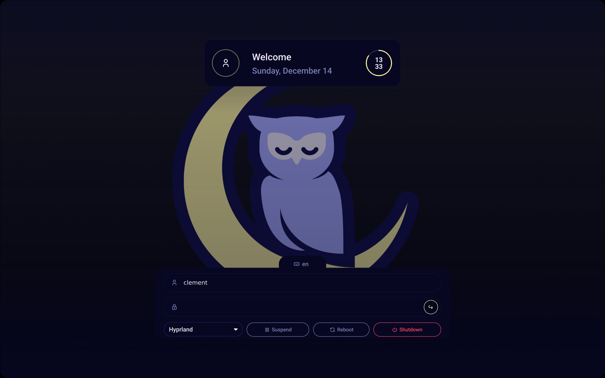

# Noctalia SDDM Theme

A sleek, modern, and highly customizable SDDM theme inspired by the [noctalia-shell](https://github.com/noctalia-project/noctalia-shell) lock screen.



## Features

- **Inspired Design**: Clean and beautiful aesthetic based on the noctalia-shell project.
- **Highly Customizable**: Easily tweak the theme to your liking through a simple configuration file.
    - **Color Schemes**: Comes with multiple popular color schemes out of the box.
    - **Wallpaper**: Set your own custom background.
    - **Layout**: Switch between compact and standard layouts.
    - **Appearance**: Adjust fonts, scaling, border radius, and more.
- **Session Management**:
    - User selection.
    - Password input with visibility toggle.
    - Session type selection (e.g., Plasma, GNOME, Hyprland).
- **System Controls**:
    - Shutdown, Reboot, and Suspend buttons.
- **Status Indicators**:
    - Battery percentage and charging status.
    - Keyboard layout indicator and switcher.
- **Clock**:
    - Choose between analog and digital styles.
    - Displays current date.

## Installation

1.  **Clone the repository:**
    ```bash
    git clone https://github.com/clementroure/noctalia-sddm.git
    ```

2.  **Copy the theme to the SDDM themes directory:**
    The target directory is usually `/usr/share/sddm/themes/`.

    ```bash
    sudo cp -r noctalia-sddm /usr/share/sddm/themes/
    ```

3.  **Set the theme in your SDDM configuration:**
    Create or edit your SDDM configuration file (e.g., `/etc/sddm.conf` or create a new file like `/etc/sddm.conf.d/theme.conf`) and set the `Current` theme.

    ```ini
    [Theme]
    Current=noctalia-sddm
    ```

    Make sure any other `Current` theme setting in other configuration files is commented out.

## Configuration

All theme settings can be adjusted in the `Commons/Settings.conf` file located inside the theme directory (`/usr/share/sddm/themes/noctalia-sddm/`).

### Main Options

| Option        | Description                                     | Default Value   | Example Values               |
|---------------|-------------------------------------------------|-----------------|------------------------------|
| `background`  | Path to the background wallpaper.               | `Assets/Wallpaper/noctalia.png` | `/path/to/your/image.png`      |
| `fontFamily`  | The font family to use for all text.            | `"Roboto"`        | `"JetBrains Mono"`, `"Cantarell"` |
| `colorScheme` | The color scheme to apply. See list below.      | `Catppuccin`    | `Dracula`, `Nord`, `Gruvbox`   |
| `darkMode`    | Use the dark or light variant of the scheme.    | `true`          | `true`, `false`              |
| `clockStyle`  | Style of the clock widget.                      | `"digital"`     | `"analog"`, `"digital"`      |

### Scaling & Appearance

These options allow you to fine-tune the UI scaling and element shapes. Values are ratios, where `1.0` is the default.

| Option              | Description                                       | Default Value |
|---------------------|---------------------------------------------------|---------------|
| `fontScale`         | Global scaling factor for all font sizes.         | `1.0`         |
| `radiusRatio`       | Adjusts the roundness of major containers.        | `1.0`         |
| `iRadiusRatio`      | Adjusts the roundness of input fields and buttons.| `1.0`         |
| `screenRadiusRatio` | Adjusts the roundness of the screen corners effect.| `1.0`         |
| `scaleRatio`        | A master scaling factor for most UI elements.     | `1.0`         |
| `animationSpeed`    | Adjusts the speed of UI animations (`>1` is faster). | `1.0`         |

### Available Color Schemes

Set the `colorScheme` option in `Settings.conf` to one of the following values:

- `Ayu`
- `Catppuccin`
- `Dracula`
- `Eldritch`
- `Gruvbox`
- `Kanagawa`
- `Noctalia-default`
- `Nord`
- `Rosepine`
- `Tokyo-Night`

### NixOS

Managing SDDM configuration can sometimes be tricky for nixos user.
If you want a nixos module example you can go check my [nixos config](https://github.com/ClementFombonne/nix-config/blob/main/modules/gui/noctalia-sddm/default.nix)

## Dependencies

- **SDDM**
- **Qt6**: This theme requires a version of SDDM compiled with Qt6.

## Credits

- **Inspiration**: [noctalia-shell](https://github.com/noctalia-project/noctalia-shell)
- **Icons**: [Tabler Icons](https://tabler-icons.io/)
- **Color Schemes**: The included color schemes are based on the work of their respective creators.

## License

This project is licensed under the **GPLv3 License**.
